Introduction
============

This Installation and Administration Guide covers SpagoBI Server version 5.1.0-r24688 (starting from FIWARE release 4.2). Any feedback on this document is highly welcomed, including bugs, typos or things you think should be included but are not. Please send it to the “Contact Person” email that appears in the [Catalogue page for this GEri](http://catalogue.fiware.org/enablers/data-viz-spagobi).

Installation
============

This page contains the basic Installation and Administration Guide for the SpagoBI Server, the reference implementation of the Data Visualization Generic Enabler, based on the [SpagoBI](http://www.spagobi.org) Open Source project. Its [online documentation](http://wiki.spagobi.org/xwiki/bin/view/Main/) is continuously updated and improved, and provides the most appropriate source to get the most up-to-date information on installation and administration. Other community tools are available, such as a [forum](http://spagobi.eng.it/jforum/forums/list.page) and a [tracker](http://spagobi.eng.it/jira/secure/Dashboard.jspa).

In this page we'll provide you some basic information, but we'll focus on the integration between SpagoBI Server and other GEs, in particular with the IdM - KeyRock and Data Lab - CKAN.

Released package description
----------------------------

SpagoBI Server is actually a collection of web applications (core application "SpagoBI" plus external engines "SpagoBI\*\*\*Engine"). The released files linked in the catalogue contain [Apache Tomcat](http://tomcat.apache.org/) 7 with all SpagoBI web applications.

Requirements
------------

-   JDK 1.7;
-   a relational Database for storing SpagoBI Metadata (MySQL, Oracle, Postgres, Ingres or HSQLDB);
-   R (http://cran.r-project.org/) needed only for advanced data-mining and social analysis.

Data to be analyzed with SpagoBI can be stored both on SQL datasources and noSQL datasources.

Installation from released package
----------------------------------

After installation of the required softwares listed before, you have to unzip the released .zip file into a folder. We'll refer to that folder as SPAGOBI\_SERVER\_HOME. The metadata database must be initialized and configured: you can find SQL scripts from [SpagoBI download page](http://forge.ow2.org/project/showfiles.php?group_id=204) in "SpagoBI 5.1 - Script db" section, you have to execute them into a database. Then you have to configure the datasource in SPAGOBI\_SERVER\_HOME/conf/server.xml:

``` xml
<Resource name="jdbc/spagobi" auth="Container"
          type="javax.sql.DataSource" 
          driverClassName="your JDBC driver class"
          url="your JDBC URL"
          username="your JDBC username"
          password="your JDBC password" 
          maxActive="20" maxIdle="10"
          maxWait="-1"/>
```

providing JDBC URL, username, password and driver class. Refer to the database documentation about the right JDBC driver to be used, and put it in SPAGOBI\_SERVER\_HOME/lib folder. Please notice that released package already contains JDBC drivers for MySQL 5.6, Postgres 9 and Oracle 11, but, in case you need a different JDBC driver, you have to replace them with the correct ones. Then edit the following files in order to set the proper dialect for the database:

-   SPAGOBI\_SERVER\_HOME/webapps/SpagoBI/WEB-INF/classes/hibernate.cfg.xml (set hibernate.dialect property according to your database)
-   SPAGOBI\_SERVER\_HOME/webapps/SpagoBI/WEB-INF/classes/jbpm.hibernate.cfg.xml (set hibernate.dialect property according to your database)
-   SPAGOBI\_SERVER\_HOME/webapps/SpagoBI/WEB-INF/classes/quartz.properties (set org.quartz.jobStore.driverDelegateClass property according to your database)

Then you have to configure some environment variables defined in SPAGOBI\_SERVER\_HOME/conf/server.xml:

``` xml
    <Environment name="spagobi_resource_path" type="java.lang.String" value="${catalina.base}/resources"/>
    <Environment name="spagobi_sso_class" type="java.lang.String" value="it.eng.spagobi.services.common.FakeSsoService"/>
    <Environment name="spagobi_service_url" type="java.lang.String" value="http://localhost:8080/SpagoBI"/>   
    <Environment name="spagobi_host_url" type="java.lang.String" value="http://localhost:8080"/>
```

-   spagobi\_resource\_path contains a reference to a path in the file system, this will be used in order to store static resources such images, i18n files, etc: you can set it as default ${catalina.base}/resources but check writing permissions;
-   spagobi\_sso\_class is a Java class that is specific for a SSO system; default value is it.eng.spagobi.services.common.FakeSsoService but you can change it when using an SSO solution (see SpagoBI online documentation for details);
-   spagobi\_service\_url is an URL used by the external engines to communicate with SpagoBI core; since SpagoBI core and external engines are installed on the same application server, you can leave it as "localhost";
-   spagobi\_host\_url is the URL that is used by the client browsers to communicate with SpagoBI; you **must** change it to the actual SpagoBI URL.

How to start and stop SpagoBI Server
------------------------------------

In order to start SpagoBI Server, you have to execute SPAGOBI\_SERVER\_HOME/bin/startup.bat (for Windows systems) or SPAGOBI\_SERVER\_HOME/bin/startup.sh (for Linux systems); use shutdown.bat or shutdown.sh to stop it. You can also install SpagoBI Server as a service, please refer to Tomcat documentation.

Users configuration
-------------------

If you start SpagoBI Server with default configuration (i.e. configuration provided within the released package), at the first start, it will initialize a default tenant ("SPAGOBI") with some predefined users (biadmin/biadmin that is superadmin, biuser/biuser that is a normal user). You can also connect SpagoBI to an external users repository, see [here](http://wiki.spagobi.org/xwiki/bin/view/spagobi_server/User+Management_v3) for details. [Here below](#Configuration_with_the_IdM_-_KeyRock "wikilink") we describe the configuration that permits you to use IdM - KeyRock as the users repository.

How to define a new JDBC datasource
-----------------------------------

In order to define a new JDBC datasource, we recommend to define it as a JNDI resource. Proceed as follows:

-   stop SpagoBI Server
-   edit SPAGOBI\_SERVER\_HOME/conf/server.xml and add a new datasource (here below we call it "mydatasource", but of course you can change the name)

``` xml
<Resource name="jdbc/mydatasource" auth="Container"
          type="javax.sql.DataSource" 
          driverClassName="your JDBC driver class"
          url="your JDBC URL"
          username="your JDBC username"
          password="your JDBC password" 
          maxActive="20" maxIdle="10"
          maxWait="-1"/>
```

-   put a valid JDBC driver in folder SPAGOBI\_SERVER\_HOME/lib
-   delete folder SPAGOBI\_SERVER\_HOME/conf/Catalina/localhost
-   edit all SpagoBI\*/META-INF/context.xml and add a new line:

``` xml
<ResourceLink global="jdbc/mydatasource" name="jdbc/mydatasource" type="javax.sql.DataSource"/>
```

-   start SpagoBI Server
-   enter web GUI with superadmin credentials, then enter Resources --&gt; Data Source
-   define a new JNDI datasource with JNDI name "java:comp/env/jdbc/mydatasource"
-   enter Resources --&gt; Tenants Management and enter the tenants that require the datasource
-   enable the datasource in the tenants by checking the corresponding item in the Data Source detail tab

How to define temporary storage for datasets cache
--------------------------------------------------

SpagoBI caches datasets into a temporary storage, that is actually a JDBC datasource. The configuration of this datasource is mandatory for ad-hoc reporting functionalities. You need to define a JDBC datasource (MySQL, HSQLDB, ...) as described in the above paragraph, but pay attention that this datasource should be configured (in the SpagoBI web GUI detail page) as "Read and write" and "Write default", and it must be enabled in all tenants.

Configuration with the IdM - KeyRock
====================================

This chapter describes the integration between SpagoBI and the IdM GE - KeyRock (REST API version 3), giving step-by-step instructions on how to configure SpagoBI and how to define organizations and roles in IdM for SpagoBI usage. The integration between SpagoBI and the IdM was developed in order to let people authenticate through the IdM, and his roles (defined in the IdM) to be inherited by SpagoBI. The configuration procedure is divided into 3 high-level steps:

-   create account and application in FIWARE Lab;
-   change SpagoBI settings;
-   retart SpagoBI server and enjoy it!

In this document we will see all of these steps in details and we will also see how to properly manage FIWARE users within the IdM. We will consider the IdM instance provided by [FIWARE Lab](https://account.lab.fiware.org/) as the reference example.

FIWARE account and application creation
---------------------------------------

**Disclaimer:** this chapter is not intended to be an exhaustive description of KeyRock, it gives only informations about its integration with SpagoBI. For more details about KeyRock please refer to its [documentation](http://forge.fiware.org/plugins/mediawiki/wiki/fiware/index.php/Identity_Management_-_KeyRock_-_User_and_Programmers_Guide).

In order to create new application in the IdM you have to open your browser first and connect to [FIWARE Lab](https://account.lab.fiware.org/). If you don't have an account click on “Sign up” under the “Sign in” form in the left: this account will be used as SpagoBI super administrator.

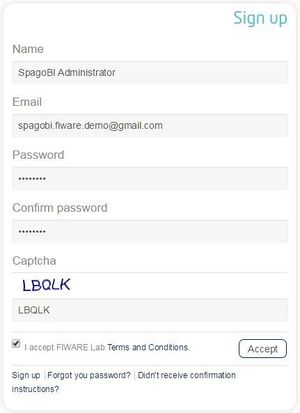

Now let's define an organization within the IdM; for this purpose, we'll create it with another user that is "SpagoBI User":

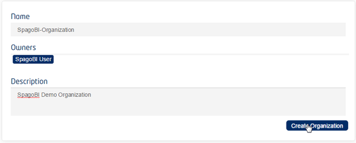

Once an organization is created, the owner can always switch between User account and Organization account. He only has to click over his name in the top right corner, put mouse over “Switch session” and select the account he wants to manage:


Using the Organization account, he can manage the organization: more precisely, he can add new members and assign roles to them. We will talk more about roles later on.

Next step consists on creating the application with your administrator account. In order to do so, click on “My Applications” on the left menu and press the “Add application” button. A 3-steps wizard will be diplayed: in the first step you have to put application's information, such as name, description, URL and callback URL. Last one is part of OAuth2 standard and it is the URL where a user has to be redirected (by the IdM) after he gives the application his permission to access some of his information.

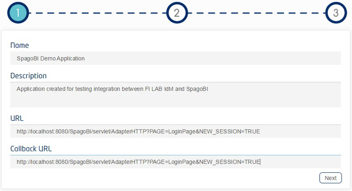

In second step you can insert the logo of your application.

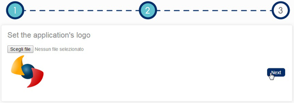

Third step requires to manage roles. There are already two predefined roles, Provider and Purchaser, but you can add your custom roles. Once SpagoBI is properly configured, roles will be imported automatically in its metadata (roles are the basis for the visibility rules over document and data in SpagoBI, therefore they are actually copied in SpagoBI metadata database). In SpagoBI there are 4 different kind of roles:

-   admin roles have administration privileges
-   dev roles have development privileges
-   test roles have test privileges
-   model\_admin roles have privileges to manage the behavioural model
-   user roles have no technical privileges, they are intended for final users

SpagoBI recognizes the type of role applying a regular expression (we will see it later): by default, role "/spagobi/admin" is considered as an admin role, and "/spagobi/user" as normal role for final users.

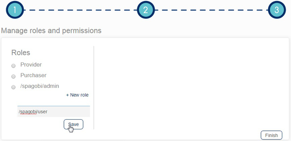

After the third step, the application is created! Next picture shows the application's home page:

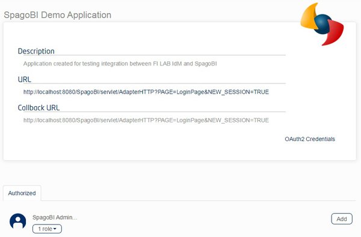

You can see application details and the list of authorized users and groups (at the bottom). Now you need to get the OAuth2 credentials: enter the details of the application and click on "OAuth2 Credentials": you can see the Client ID and the Client Secret. These informations are part of the OAuth2 standard and they will be used by SpagoBI in order to communicate with the IdM.

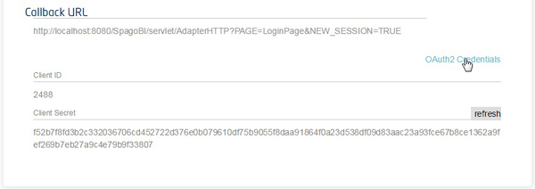

In order to manage users associated with the application, go back to the application page, in the “Authorized” box. For each user you can add or remove roles by selecting the ones provided by the drop-down menu:

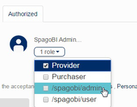

The available roles are “Provider”, “Purchaser” (these will be ignored by SpagoBI) and all the custom roles defined during application registration. You can assign more than one role to one user. If no roles are assigned to an user, he will enter SpagoBI with a default role that can be set within SpagoBI by the administrator. See next chapter for more details.

Inside the “Authorized” box you can also add users to the application by clicking on the “Add” button on the right.

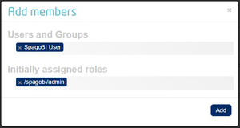

Users added in the application directly (i.e. not within an organization) will belong to the default tenant in SpagoBI, which name is "SPAGOBI".

It's possible to add organizations in the application in the exact same way as we did for users. Those organizations will be considered as separated tenants in SpagoBI. As we've seen before, an organization's administrator can assign roles to members within the IdM: this will be reflected in SpagoBI where corresponding tenant's members will have those roles. In order to use organizations properly, they must have “Provider” or “Purchaser” role in the application, otherwise the administrator would not be able to give application's roles to organization's members.

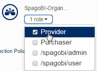

In other words, if an organization is added as Provider or Purchaser, its owner can give applications roles to whoever he wants. As said before, if you are an organization owner and you switch to the Organization account, you can manage roles of organization's members. The way you do that is very similar as how the application roles are assigned within the application's page: for each organization member there is a drop-down menu with the available roles: this list is comprehensive of roles of all applications for whom the organization is authorized.

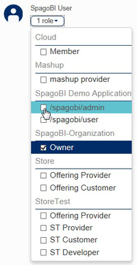

The above image shows how, for an organization owner, it is possible to give Application custom roles (in this case, the two roles defined before: /spagobi/admin and /spagobi/user) to a member of the organization.

Pay attention to the fact that, since SpagoBI doesn't allow users to belong to more than one tenant, in case an user has application's roles distributed in more than one organization, only one tenant will be assigned to him and only roles associated with the corresponding organization will be considered by SpagoBI. "SPAGOBI" default tenant has priority over the others, so if an user is added directly in the application (not within an organization) and also by an organization owner, he will belong to "SPAGOBI" tenant and his roles will be the ones defined by the application administrator. If an user belongs to different organizations, there are no particular rules on how tenant will be chosen, so you should avoid this situation.

SpagoBI configuration
---------------------

In order to authenticate in SpagoBI using FIWARE Lab accounts, SpagoBI has to be configured properly. In this chapter we will explain how to achieve that.

First of all, start SpagoBI normally: as explained before, the SPAGOBI default tenant is created and some default users are created. Then enter with the default super administrator user, that is biadmin/biadmin; then, enter "Configuration management" as in picture below:

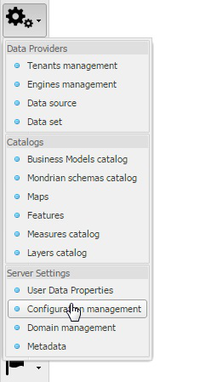

You will see the main SpagoBI Server configuration table. Each row correspond to one parameter, its value is stored in the VALUE\_CHECK column.

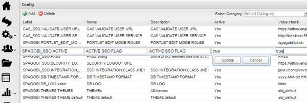

Change the following settings (change their VALUE\_CHECK property):

-   SPAGOBI\_SSO.ACTIVE = true
-   SPAGOBI.SECURITY.PORTAL-SECURITY-CLASS.className = it.eng.spagobi.security.OAuth2SecurityInfoProvider
-   SPAGOBI.SECURITY.USER-PROFILE-FACTORY-CLASS.className = it.eng.spagobi.security.OAuth2SecurityServiceSupplier
-   SPAGOBI\_SSO.SECURITY\_LOGOUT\_URL = <https://account.lab.fiware.org/users/sign_out>

Beyond previous settings, there are other configurations that can be made (optional):

-   SPAGOBI.SECURITY.ROLE-TYPE-PATTERNS.DEV\_ROLE-PATTERN
-   SPAGOBI.SECURITY.ROLE-TYPE-PATTERNS.TEST\_ROLE-PATTERN
-   SPAGOBI.SECURITY.ROLE-TYPE-PATTERNS.MODEL\_ADMIN-PATTERN
-   SPAGOBI.SECURITY.ROLE-TYPE-PATTERNS.ADMIN-PATTERN
-   SPAGOBI.SECURITY.DEFAULT\_ROLE\_ON\_SIGNUP

The first four are patterns used by SpagoBI to recognize new roles and give them particular privileges. For example, the default VALUE\_CHECK for SPAGOBI.SECURITY.ROLE-TYPE-PATTERNS.ADMIN-PATTERN is "/spagobi/admin". When a user with this role enters SpagoBI, he is recognized as administrator. You can change these patterns and permit SpagoBI to import roles with different names than the default ones. The last one (SPAGOBI.SECURITY.DEFAULT\_ROLE\_ON\_SIGNUP) is the role given to a user that authenticates for the first time and who doesn't have any particular roles. At this point, you need to stop SpagoBI server to activate SSO with the IdM. First of all, edit SPAGOBI\_SERVER\_HOME/conf/server.xml and set spagobi\_sso\_class variable as it.eng.spagobi.services.oauth2.Oauth2SsoService:

``` xml
<Environment name="spagobi_sso_class" type="java.lang.String"
       value="it.eng.spagobi.services.oauth2.Oauth2SsoService"/>
```

Then edit SPAGOBI\_SERVER\_HOME/webapps/SpagoBI/WEB-INF/web.xml: activate the Oauth2Filter (in the default package it is disabled):

``` xml
<!-- START OAUTH 2 -->
<filter>
    <filter-name>OAuthFilter</filter-name>
    <filter-class>it.eng.spagobi.security.oauth2.OAuth2Filter</filter-class>
</filter>
<!-- END OAUTH 2 -->
```

and the corresponding filter mapping

``` xml
<!-- START OAUTH 2 -->
<filter-mapping>
    <filter-name>OAuthFilter</filter-name>
    <url-pattern>/servlet/AdapterHTTP/*</url-pattern>
</filter-mapping>
<!-- END OAUTH 2 -->
```

Then edit SPAGOBI\_SERVER\_HOME/webapps/SpagoBI/WEB-INF/classes/oauth2.config.properties and set:

-   CLIENT\_ID and SECRET has to be copied from FIWARE Lab application detail page inside "Oauth2 Credentials" section
-   AUTHORIZE\_URL contains the URL used to retrieve the access code as specified in OAuth2 standard (when using FIWARE Lab instance use <https://account.lab.fiware.org/oauth2/authorize>)
-   ACCESS\_TOKEN\_URL contains the URL used to retrieve the token (given the access code) as specified in OAuth2 standard (when using FIWARE Lab instance set it as <https://account.lab.fiware.org/oauth2/token>)
-   USER\_INFO\_URL contains the URL used to retrieve users' information as specified in OAuth2 standard (when using FIWARE Lab instance set it as <https://account.lab.fiware.org/user>)

<!-- -->

-   REDIRECT\_URI must contain the URL specified as "Callback URL" in the application details
-   REST\_BASE\_URL is the url of IdM REST services (when using FIWARE Lab instance set it as <http://cloud.lab.fiware.org:4730/v3/>)
-   TOKEN\_PATH contains the URL path that has to be invoked if you want to obtain the authentication token of an user. It is used, together with REST\_BASE\_URL, ADMIN\_EMAIL and ADMIN\_PASSWORD, to retrieve administrator's authorization token to extract application details (when using FIWARE Lab instance set it as auth/tokens)
-   ROLES\_PATH contains the URL path that has to be invoked if you want to obtain the list of application's roles (when using FIWARE Lab instance set it as OS-ROLES/roles)
-   ORGANIZATIONS\_LIST\_PATH is the URL path that has to be invoked if you want to obtain the list of application's organizations (when using FIWARE Lab instance set it as OS-ROLES/organizations/role\_assignments)
-   ORGANIZATION\_INFO\_PATH contains the URL path that has to be invoked if you want to obtain informations about an organization (when using FIWARE Lab instance set it as projects/)
-   APPLICATION\_ID is the id of the FIWARE Lab application. To obtain the correct id of the application, open its detail page and look at the browser URL (for example, in FIWARE Lab instance, if your application page's URL is <https://account.lab.fiware.org/idm/myApplications/id_number/>, the APPLICATION\_ID is "id\_number")

<!-- -->

-   ADMIN\_ID is the id of the administrator on IdM. To obtain it, open the user page on the IdM (by clicking on the name of the user on the top right part of the page) and and look at the browser URL (for example, in FIWARE Lab instance, if your user page's URL is <https://account.lab.fiware.org/idm/users/id_number/>, the ADMIN\_ID is "id\_number")

<!-- -->

-   ADMIN\_EMAIL and ADMIN\_PASSWORD are the administrator credentials specified during administrator registration

The default settings were configured considering the FIWARE Lab instance, therefore, if you want to use the same instance, you have only to set the following properties: CLIENT\_ID, SECRET, REDIRECT\_URI, APPLICATION\_ID, ADMIN\_ID, ADMIN\_EMAIL and ADMIN\_PASSWORD.

To enable multi-tenancy, edit SPAGOBI\_SERVER\_HOME/webapps/SpagoBI/WEB-INF/conf/config/initializer.xml and substitute MetadataInitializer with OAuth2MetadataInitializer:

``` xml
<!-- Initializer for SpagoBI metadata -->
<INITIALIZER class="it.eng.spagobi.commons.initializers.metadata.OAuth2MetadataInitializer" config="" />
```

Finally, if your SpagoBI Server is behind by a proxy, you have to set its configuration in the JVM's arguments of the Tomcat process:

-   -Dhttp.proxyHost=<your proxy host>
-   -Dhttp.proxyPort=<your proxy port>
-   -Dhttp.proxyUsername=<your proxy user>
-   -Dhttp.proxyPassword=<your proxy password>
-   -Dhttp.nonProxyHosts="localhost|127.0.0.1"

That's it! After restarting SpagoBI server you should be able to sign in using a FIWARE account!

SpagoBI Notifications
---------------------
In order to use SpagoBI Notifications capabilities, it's necessary to modify some parameters. These parameters are necessary to be able to notify from [Orion Context Broker OCB](https://github.com/telefonicaid/fiware-orion).

Open the file `SpagoBIConsoleEngine/WebContent/WEB-INF/web.xml` and change:

```xml
		<init-param>
			<param-name>notifyUrl</param-name>
			<param-value>http://192.168.93.1:8080/SpagoBIConsoleEngine/datasetNotifier</param-value>
		</init-param>
```

with your SpagoBI host url, for example:

```xml
		<init-param>
			<param-name>notifyUrl</param-name>
			<param-value>http://www.my-personal-spagobi.com:8080/SpagoBIConsoleEngine/datasetNotifier</param-value>
		</init-param>
```

This url is used by OCB to send notifications to SpagoBI.


Using FIWARE IdM and SpagoBI
----------------------------

At this point, if you invoke SpagoBI by your browser, you are redirected into FIWARE IdM instance. Once logged in, FIWARE IdM will ask you to authorize the application:

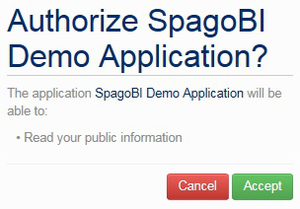

Of course you have to authorize the application, and you will sent back to SpagoBI. As already explained, if the user has no roles defined by the IdM, he will enter SpagoBI with a default role specified in SpagoBI configurations.

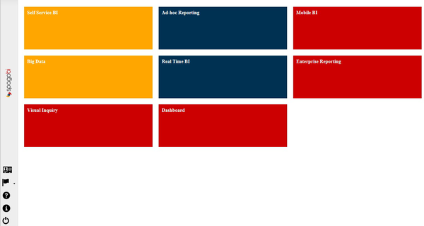

In this case, the application administrator can add roles to that user (the user has to logout and login again in order to benefit of it). If the user has already been added with some roles for the application, he will automatically inherit those roles in SpagoBI.

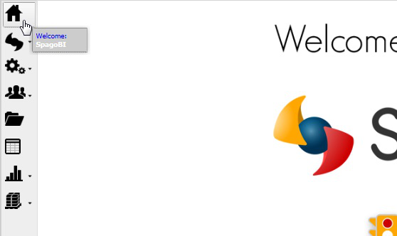

The application administrator can always change roles of the users (the ones who belong to "SPAGOBI" tenant) within the IdM. Organization owners can always change roles of members (and these members will belong to a tenant with the same name of the organization).

Finally, each tenant has to be configured in SpagoBI: its members cannot use any engine or any datasource if not specified. To permit a tenant's users to use engines and datasources, login as the super administrator (the creator of the FIWARE Lab application) and enter "Tenants management":

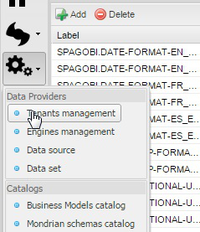

Then, for each tenant, enable required engines (in the "Engines" tab) and datasources (in the "Data Source" tab):

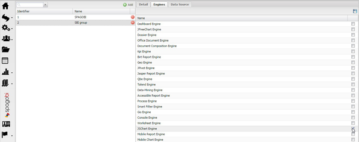

Pay attention to the fact that, if a new tenant is added (in FIWARE IdM as organization), SpagoBI Server doesn't recognize it automatically unless you restart it. If you don't want to do that you have to add the new tenant manually.
