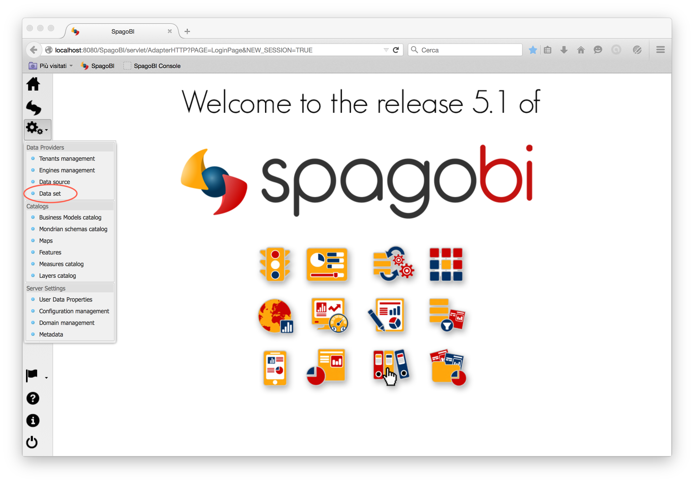
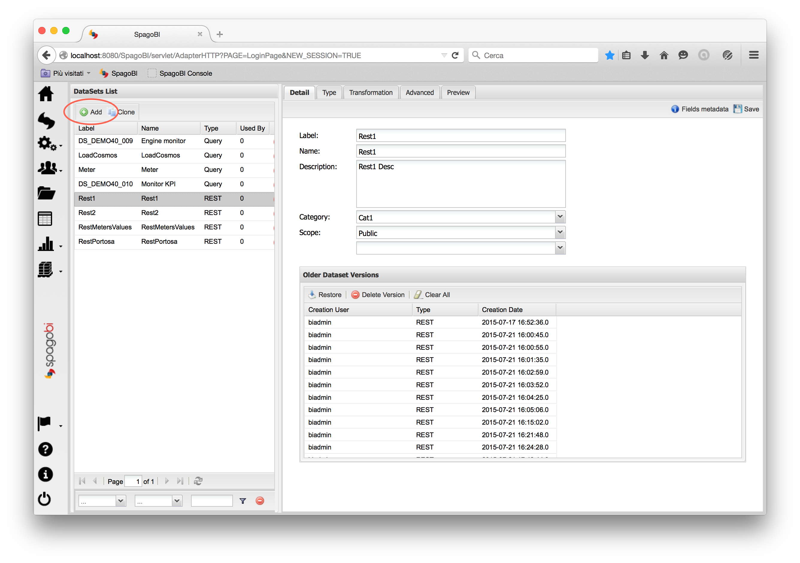
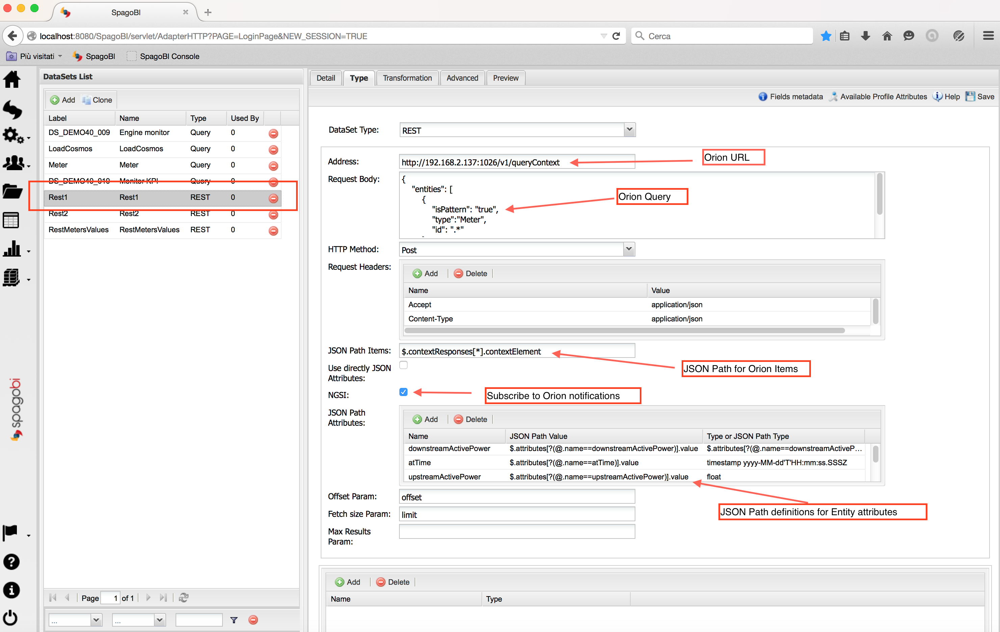
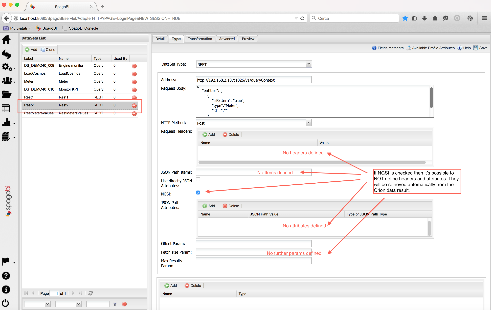
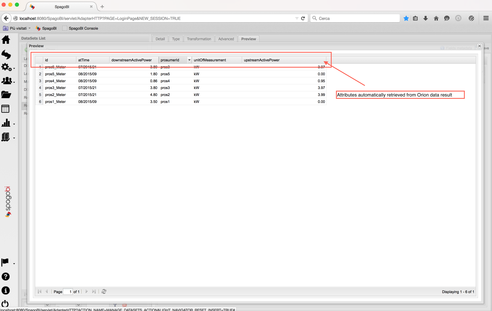
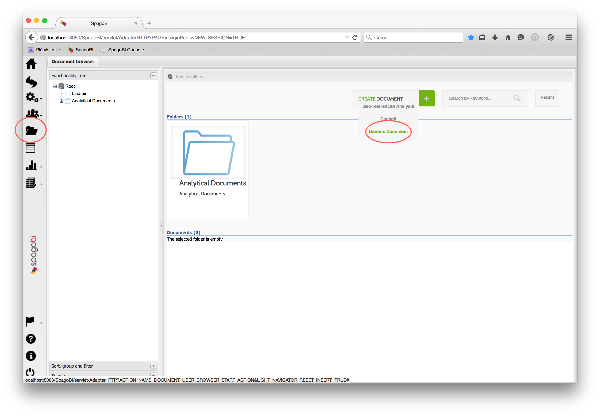
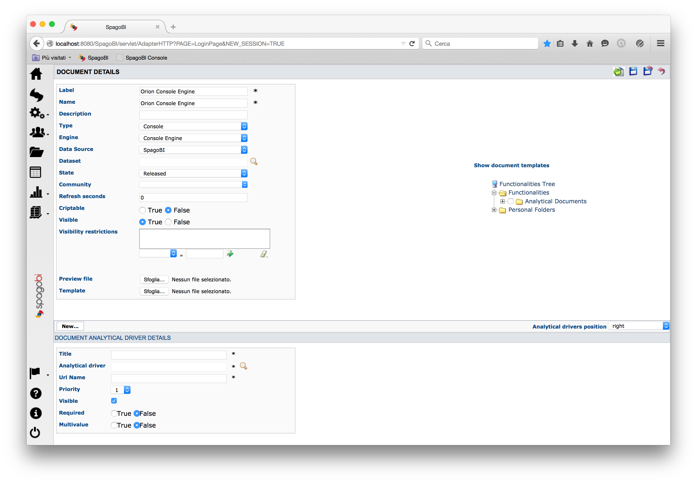
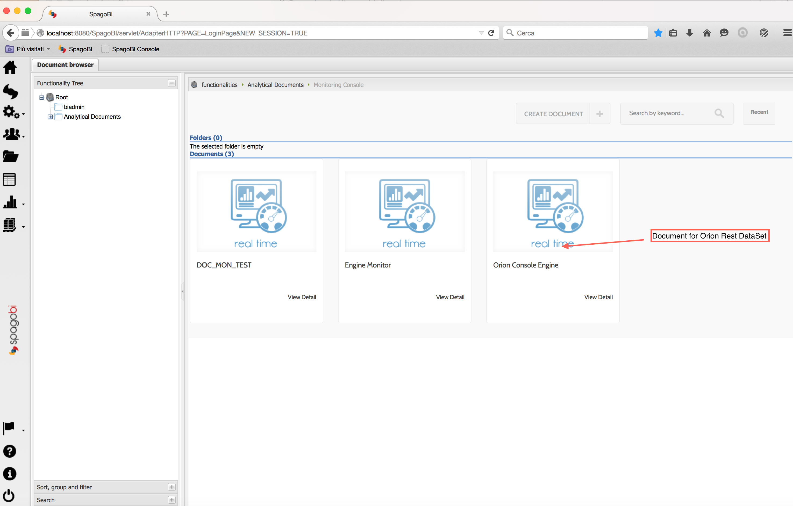
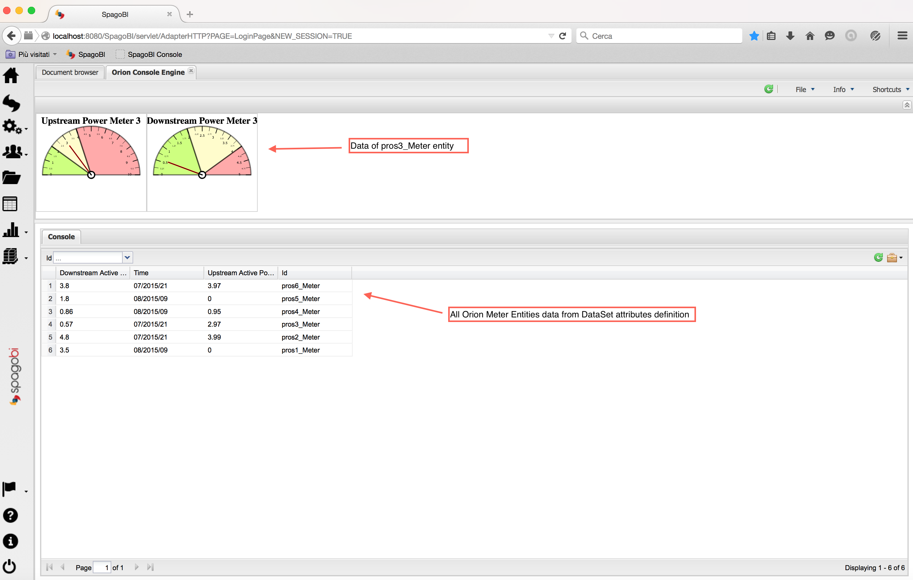
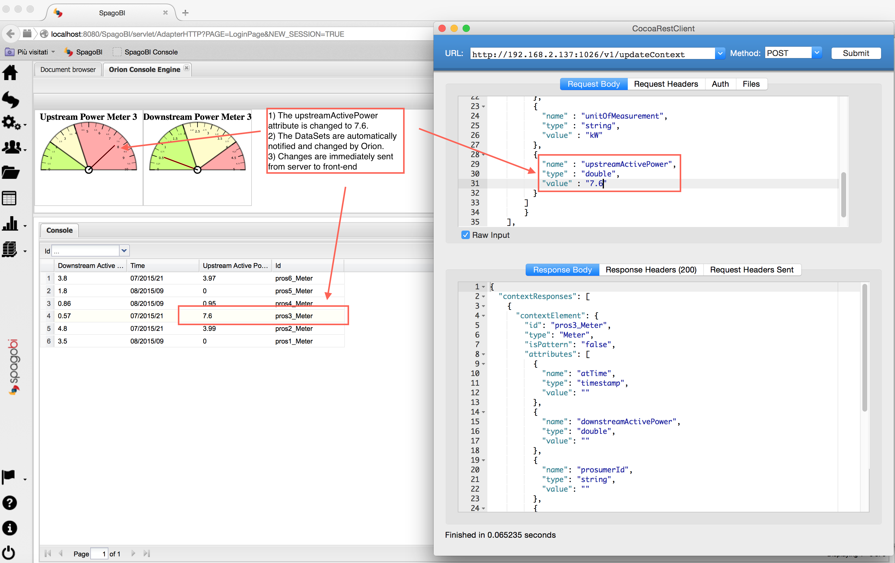

SpagoBI and NGSI
=======================================

Introduction
============

What is NGSI?
-------------
NGSI is a protocol developed by OMA to manage Context Information. It provides operations like:

* Manage the Context Information about Context Entities, for example the lifetime and quality of information.
* Access (query, subscribe/notify) to the available Context Information about Context Entities.

The FI-WARE version of the OMA NGSI interface is a RESTful API via HTTP. Its purpose is to exchange context information. The three main interaction types are

* one-time queries for context information
* subscriptions for context information updates (and the corresponding notifications)

Mission
-------
SpagoBI extends its set of data sources by providing native and out-of-the-box NGSI integration. 
SpagoBI permits to create REST dataset of type NGSI that show current information data and collects notifications of context updates in order to modify the data underneath the SpagoBI documents, using it.

Integration 
============

Dataset mapping between SpagoBI and NGSI
----------------------------------------
The term *dataset* in SpagoBI indicates a unique data resource. It can be anything: a CSV file, a SQL query against a DB, a Java class, and so on. In NGSI environment a standard SpagoBI *dataset* is a collection of Context Entities with their attributes. These Context Entities are retrieved from the NGSI Provider (currently the [Orion Context Broker OCB](https://github.com/telefonicaid/fiware-orion)) through a REST call. The answer of this call represents the Context Entities in JSON format. 

The following examples are based on a demo. The `Meter` Context Element represents a power sensor: it saves the upstream and downstream active power in an instant of a prosumer (a producer/consumer of electricity).
So, for example a REST call query takes this body:

	{
	    "entities": [
	        {
	            "isPattern": "true",
	            "id": ".*",
	            "type":"Meter"
	        }
	    ]
	}
	
It retrieves all entities of type `Meter`. The response will be something like:

	{
	  "contextResponses": [
	    {
	      "contextElement": {
	        "id": "pros6_Meter",
	        "type": "Meter",
	        "isPattern": "false",
	        "attributes": [
	          {
	            "name": "atTime",
	            "type": "timestamp",
	            "value": "2015-07-21T14:49:46.968+0200"
	          },
	          {
	            "name": "downstreamActivePower",
	            "type": "double",
	            "value": "3.8"
	          },
	          {
	            "name": "prosumerId",
	            "type": "string",
	            "value": "pros3"
	          },
	          {
	            "name": "unitOfMeasurement",
	            "type": "string",
	            "value": "kW"
	          },
	          {
	            "name": "upstreamActivePower",
	            "type": "double",
	            "value": "3.97"
	          }
	        ]
	      },
	      "statusCode": {
	        "reasonPhrase": "OK",
	        "code": "200"
	      }
	    },
	    {
	      "contextElement": {
	        "id": "pros5_Meter",
	        "type": "Meter",
	        "isPattern": "false",
	        "attributes": [
	          {
	            "name": "atTime",
	            "type": "timestamp",
	            "value": "2015-08-09T20:29:45.698+0200"
	          },
	          {
	            "name": "downstreamActivePower",
	            "type": "double",
	            "value": "1.8"
	          },
	          {
	            "name": "prosumerId",
	            "type": "string",
	            "value": "pros5"
	          },
	          {
	            "name": "unitOfMeasurement",
	            "type": "string",
	            "value": "kW"
	          },
	          {
	            "name": "upstreamActivePower",
	            "type": "double",
	            "value": "0"
	          }
	        ]
	      },
	      "statusCode": {
	        "reasonPhrase": "OK",
	        "code": "200"
	      }
	    }
	  ]
	}

In this example we have two Context Elements with the following attributes:

* atTime
* downstreamActivePower
* prosumerId
* unitOfMeasurement
* upstreamActivePower

The related SpagoBI dataset will contain these entities with the related attributes mapped with the types defined in the response.

How to use SpagoBI with NGSI
============================

DataSet creation
----------------
Defining a REST NGSI DataSet in SpagoBI is like to define any other type of DataSet. We need to create a REST DataSet and then make it NGSI enable.
At the homepage of application, click on DataSet:



then create a DataSet clicking on Add and fill all main fields (name, label, etc.):



Now click on Type tab, select REST type and fill all fields related to a generic REST DataSet plus clicking on NGSI checkbox:



So you need to define (see also below to simplify these fields):

* the Orion Query Context URL
* the request headers for an JSON call
* the Orion Query as the Request body
* the HTTP Method
* the JSON Path to retrieve the items (see below): so where the items are stored in JSON (Context Elements)
* check NGSI checkbox
* the JSON Paths to retrieve the attributes (see below): where the attributes of each Context Element are stored
* offset and fetch size params

The fields for items and attributes are written in [JSON Path Notation](https://github.com/jayway/JsonPath), which is similaro to XML XPath notation. As you can see from the image the Context Elements are searched under the array of Context Responses (as described before in the JSON Response example). The attributes' definitions are related to JSON of each Context Element found through items field.

**NGSI checkbox** is specific for NGSI REST calls: it permits to subcribe to Context Element notifications from Orion Context Broker and to omit some of the REST fields (since the JSON format from NGSI specifications is fixed). So considering the previous example, it's possible to **not** define:

* the request headers
* the items
* the attributes: all attributes are fetched
* the offset and fetch size params



If you click on preview button you can see the current data retrieved from OCB defined:



At the end of DataSet definition lick on Save button in the upper-right cornet to save the DataSet.

Document Definition
-------------------
A *Document* in SpagoBI environment permits to use the DataSet previous created to make reports, statistics, visualization of data etc.. In the following example we create a Document of type *Console* because is strictly related to Rest NGSI DataSet. With this type of Document you can see the notifications of Context Elements changes from OCB in real time.
So, start to create a Document clicking on folder icon at homepage:



Fill all fields like any other document but select the Console type/Console Engine:



Upload the Console template of your Document. In our example we use this template:

	{
		//the datasets necessary for our document
		datasets : [
			{
				id : 'RestMetersValues',
				label : 'RestMetersValues',
				//not strictly necessary, make a refresh of data every 1000 seconds, in case of some errors from OCB
				refreshTime : 1000,
				//update the document using notifications from OCB
				notifyFromServer:true
			},
			{
				id : 'Rest1',
				label : 'Rest1',
				//not strictly necessary, make a refresh of data every 1000 seconds, in case of some errors from OCB
				refreshTime : 1000,
				//update the document using notifications from OCB
				notifyFromServer:true
			}
		]
	
		,summaryPanel : {
			// layout properties
			collassable : true,
			collapsed : false,
			hidden : false,
			height : 200,
			layoutManagerConfig: {
		        layout:'column',
		        columnNumber: 2,
		        columnWidths: [0.5,0.5] 
			},
	
			charts : [ 
				{
					//first speedometer
			     	dataset: 'RestMetersValues',
			     	width: 180,
			     	height: 160,
			     	widgetConfig: {
			             type: 'chart.sbi.speedometer'
			             , title:'Upstream Power Meter 3'
			             , minValue: 0
			             , maxValue: 10
			             , lowValue: 2
			             , highValue: 4
			             , field: 'upstreamActivePower'
			             , styles: {                       
		                         plot: {
		                       widthScale: 2.0
		                       , heightScale: 3.0
		                       , valign: 'bottom'
		                       , halign: 'left'
		                   }
		                       
		                }
		            }
		        },{
		        	//Second speedometer
			     	dataset: 'RestMetersValues'
			        , width: 180
			        , height: 160
			        , widgetConfig: {
			             type: 'chart.sbi.speedometer'
			             , title:'Downstream Power Meter 3'
			             , minValue: 0
			             , maxValue: 5
			             , lowValue: 2
			             , highValue: 4
			             , field: 'downstreamActivePower'
			             , styles: {                       
								 plot: {
								widthScale: 2.0
								, heightScale: 3.0
								, valign: 'bottom'
								, halign: 'left'
							}    
			            }
			        }
				} 
			]
		}
	
			//--------------------------------------------------------------------------------
			// DETAIL PANEL
			// -------------------------------------------------------------------------------
			,
			detailPanel : {
				pages : [
	
				//--------------------------------------------------------------------------------
			// Page 1
			// -------------------------------------------------------------------------------
			{
				title : 'Console'
				
				// -- Navigation bar -------------------------------------------------------------
	
				,
				table : {
					dataset : 'Rest1',
					columnId : 'id', //the column ID of the single row
					showColumnId : true,
					
					 columnConfig: {
						 'id': {
	                          width: 120
	                        , header: 'Id'
	                      },
	                      'downstreamActivePower': {
	                          width: 120
	                        , header: 'Downstream Active Power'
	                      },
	                      'atTime': {
	                          width: 120
	                        , header: 'Time'
	                      },
	                      'upstreamActivePower': {
	                          width: 120
	                        , header: 'Upstream Active Power'
	                      }
	                  },
					filterBar : {
						type : 'custom',
						defaults : {
							operator : 'EQUALS_TO',
							operand : 'DISTINCT'
						}
	
						,
						filters : [ {
							text : 'Id',
							column : 'id',
							operator : 'EQUALS_TO',
							operand : 'DISTINCT'
						} ]
	
						,
						actions : [ {
							name : 'refresh',
							tooltip : 'Refresh console data',
							hidden : false,
							config : {}
						}]
					},
					inlineCharts : [],
					inlineActions : []
				}  	
			} ]
		}
	}; 

The main difference from an usual Console Template is the `notifyFromServer:true`: it permits to refresh the Document when a new notification arrives from OCB.

Save the document clicking on Save button. Now return to the main Document page (where you clicked the Creation Document button) and select the created Document:



Now you can see the data retrieved from OCB:



Now we modify a Context Element (Cocoa Rest Client is an application to make REST calls ). The change is immediately reflected on Console Document: the speedometers goes up/down and the related line in table becomes yellow with the new value:



### Chart Engine

In addition to Console Engine it's also possible to add notifications capabilities to a Chart Engine Document. The document parameter for this functionality is the following (similar to Console Engine) :

```xml
	<EXTCHART animate="true" height="500" shadow="true" width="600">
	<!-- Add this element for notifications -->
	<NOTIFY_FROM_SERVER />
	<LEGEND position="bottom"/>
	...
``` 

### Demo

You can see the entire video of DataSet creation and Document usage (gif animated):


